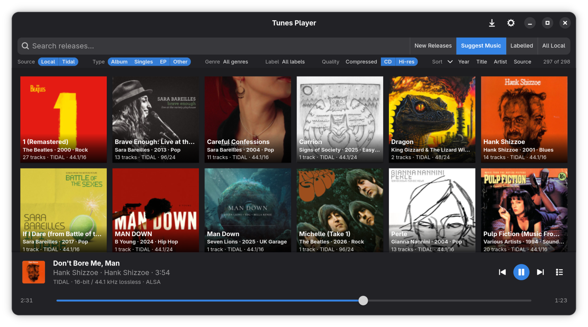

# Tunes

**Tunes** is a music app to search, discover, and play music from your own files and streaming subscriptions (Qobuz, TIDAL). It is free and open source, built for Linux with a native GNOME look.

- **One place for your music** — local library and streaming services in the same app
- **Browse and discover** — search, new releases, and suggestions without switching apps
- **Audiophile-friendly local playback** — bit-perfect listening when you want it
- **Simple and native** — a straightforward desktop app, not a heavy media suite



## Discover and browse

- One search across your library and signed-in streaming catalogs
- **New Releases** and **Suggest Music** for discovery
- Browse by release — grid view and detail pages with artwork
- Filter and sort the current view

## Playback and audio quality

- Play, pause, skip, and manage a queue from the Now Playing bar
- **Bit-perfect playback** — Tunes passes the original music data from the source to the playback device
- Hardware volume on the **sound device** where possible, software volume control inside the app as a fallback
- The app **shows honestly** whether playback is bit-perfect or not

## Install

Download the latest package from
[GitHub Releases](https://github.com/mbrennwa/tunes-player/releases).

**Debian 12+ / Ubuntu 24.04+** (`tunes-player_*.deb`):

```bash
sudo apt install ./path/to/tunes-player_*.deb
```

**Fedora** (and compatible dnf-based systems; `tunes-player-*-1.noarch.rpm`):

```bash
sudo dnf install ./path/to/tunes-player-*-1.noarch.rpm
```

`apt` / `dnf` install dependencies automatically. After install, **Tunes** appears in the application menu.

Add music folders in **Settings → Sources**, and sign in to TIDAL or Qobuz to enable streaming. For **Qobuz**: enter an App ID and App Secret in Settings, then sign in with your account. Qobuz did not provide these to the Tunes project, but `ID=942852567` and `secret=761730d3f95e4af09ac63b9a37ccc96a` as used by other open-source tools works fine.

To build or run from source, see [docs/ARCHITECTURE.md](docs/ARCHITECTURE.md).

## Diagnostics

Logs go to `~/.local/state/tunes-player/tunes-player.log`. Useful env flags:

| Variable | Effect |
|----------|--------|
| `TUNES_LOG_LEVEL=DEBUG` | More verbose file logging |
| `TUNES_LOG_STDERR=1` | Mirror full log level to stderr |
| `TUNES_PLAYBACK_HEALTH_LOG=0` | Disable playback health monitor (on by default; #67) |
| `TUNES_POSITION_POLL_LOG=1` | Spam mpv position polls to stderr |
| `TUNES_GRID_TRACE=1` | Log browse-grid recreate decisions (`grid_trace`; off by default; #75) |

## Streaming disclaimer

Tunes is **not affiliated with Qobuz, TIDAL, or any other streaming provider**.
Streaming requires your own paid subscriptions where applicable. Features can break when providers change authentication or terms. Use at your own responsibility and in compliance with each service's terms of use.

**Save to disk** uses the same streaming endpoints as playback (not an official download/purchase API). Saving streams may conflict with a provider's terms; you remain responsible for lawful use. Files go to a dedicated **Downloads folder** (Settings → Application), not into your music library folders unless you add that folder under Sources. Stream quality follows the shell quality filter (highest allowed tier), the same ceiling as playback. Some TIDAL tracks are delivered as DASH/MPD and require **ffmpeg** on your `PATH` to remux into a single file.

## License

GPL-3.0-or-later — see [LICENSE](LICENSE).

This project was developed with substantial assistance from AI coding tools. The code was reviewed through iterative development, discussion, testing, and acceptance by the project maintainer. A targeted search for third-party code did not identify any license incompatibilities.
